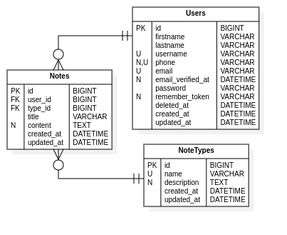
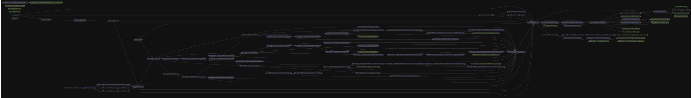

<h1 align="center">Notes Web Service</h1>
<p align="center">
  
</p>

### It's a fancy, optimal, minimalist and organized JavaScript/NodeJS "Notes Web Service" project; made with express and mongoose and has the following features:

- Layered/Hexagonal architecture implementation.
- High cohesion and separation of concerns levels.
- App core independent from frameworks/libraries.
- Separated app and server logic.
- Central error handling with rotative file log system.
- Extendable base error.
- Gracefully exit in certain cases.
- Base extendable environment config.
- Single and group testable modules.
- API versioning.
- Database:
  - MongoDB:
    - Seeders.
- JWT authentication.
- Google authentication.
- Mail handling.
- Containerizable (docker-compose and dockerfile working soon).
- Flexible search module.
- Soft deleting and more...

To initialize the project run ```npm install```.

The base relational model looks like:
<p align="center">
  
</p>

There's a graph of structure or dependencies through the application:
<p align="center">
  
</p>

Also the project contain in the root a postman collection with every application endpoint, ready to import and test.

To start the application once initialized, if you want to run it with common node but without set ```NODE_ENV=production``` to you must use ```npm run start:dev```, if you want to start with nodemon you must run ```npm run dev``` and if you want to run it in production you must use ```npm run start```.

If once you've configured your seeders (located in the path ```src/shared/services/database/mongodb/seeders```) you want to perform a seeding run ```npm run seed:mongodb```.

<h1 align="center">Other versions</h1>

If you want to check the TypeScript version [click here]()

If you want to check the PHP version [click here]()